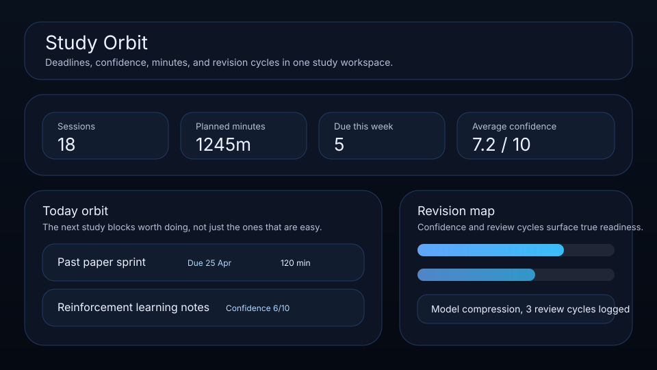

# Study Orbit

A local-first study planner for deep work blocks, revision cycles, and exam readiness.



Study Orbit is a focused study board for students and solo learners who want something calmer than a task manager and lighter than a full LMS. It helps you plan serious blocks, track confidence, and see what needs revision next.

## What it does

- ranks study sessions by urgency, importance, confidence, and friction
- tracks **due dates**, **planned minutes**, **review cycles**, and **confidence** per session
- highlights the next deadline, strongest knowledge area, and heaviest block
- includes quick actions for starting a focus block, logging a review cycle, and marking work complete
- exports a deterministic coach brief helper for AI study agents and evaluation tests
- renders a “today orbit” queue and a category load map beneath the main board
- saves locally in the browser with JSON import/export backups

## Why it feels different

Study Orbit is designed for real study rhythm, not fake productivity. It nudges you toward the next meaningful block, keeps revision visible, and helps you judge readiness instead of just collecting unfinished cards.

## Quick start

```bash
git clone https://github.com/get2salam/study-orbit.git
cd study-orbit
python -m http.server 8000
```

Then open <http://localhost:8000>.

## Verify

The scoring contract (urgency curve, state demotion, overdue handling, sanitization) is covered by a small `node:test` suite with no external dependencies:

```bash
npm test           # run the scoring contract tests
npm run check      # syntax-check the browser modules
npm run verify     # both, the same gate CI runs
```

## Keyboard shortcuts

- `N` creates a new study block
- `/` focuses the search box
- `Esc` clears the search and filters (works from the search box too)

## Data shape

```json
{
  "boardTitle": "MS AI study orbit",
  "items": [
    {
      "title": "Past paper sprint",
      "module": "Exam drills",
      "category": "Practice",
      "state": "Planned",
      "score": 9,
      "confidence": 5,
      "minutes": 120,
      "reviews": 0,
      "dueDate": "2026-04-25"
    }
  ]
}
```

## Privacy

Everything stays in your browser unless you export a JSON backup.

## License

MIT
